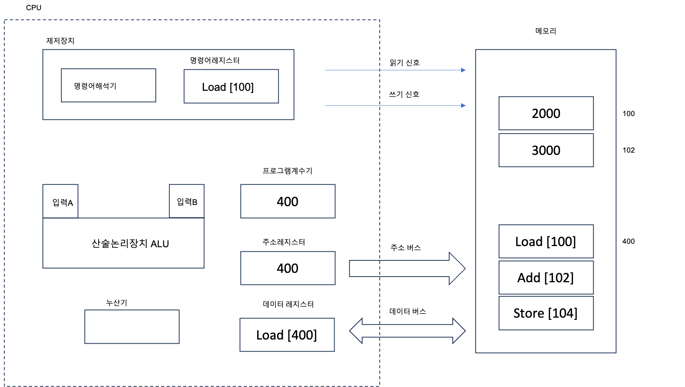

### 1. 프로그램 작성
- C 소스코드 파일
   - a, b 변수 값 더해서 c에 저장 
```
short a = 2000;
short b = 3000;
short c = a + b
```

- 컴파일 후 기계어 파일
```
.data
   0000011111010000
   0000101110111000
.code
   0000000001100100
   0001000001100110
   0001110001101000
```
 - 00(주소지정) 000(연산코드) 00001100100(피연산자)
 - 어셈블리 언어로 기계어 파일을 변환해보면
   ```agsl
   .data
      2000
      3000
   .code
      load [100]
      add [102]
      store [104]
   ```
   -  load [100] : 100번지 수치 데이터를 누산기에 올려라

### 2. 프로세스화
- 기계어 파일을 실행시키면
- 메모리에 data, code영역이 각가 올라감

### 3. CPU 명령어 처리


- 명령어 인출
- 명령어 해석
- 명령어 실행
#### 1. 명령어 인출
- 프로그램계수기 400 주소 는 주소레지스터 통해서 주소버스로 나감
- 제어장치 읽기 신호 보냄
- 주소, 읽기신호 받은 메모리는 해당 주소 명령어 (Load [100]) 데이터버스 통해 데이터레지스터로 보냄
- Load [100] 명령어는 데이터레지스터에서 명령어레지스터로 들어감

#### 2. 명령어 해석
- Load [100]를 주소 400의 데이터를 누산기로 올려라 로 해석

#### 3. 명령어 실행
- 명령어의 피연산자 주소 [100]은 주소레지스터 거쳐 주소버스로 나감
- 제어장치는 읽기 신호 보냄
- 메모리는 해당주소의 수치데이터 (2000)를 데이터 버스 통해서 데이터레지스터로 보냄
- 2000은 데이터레지스터에서 누산기로 들어감
- 명령어는 완료
- 다음 (add [100]) 실행을 위해 프로그램계수기값 '자동증가'


___
참고 : 동작원리를 그림으로 설명한 컴퓨터 구조와 운영체제 ch.4