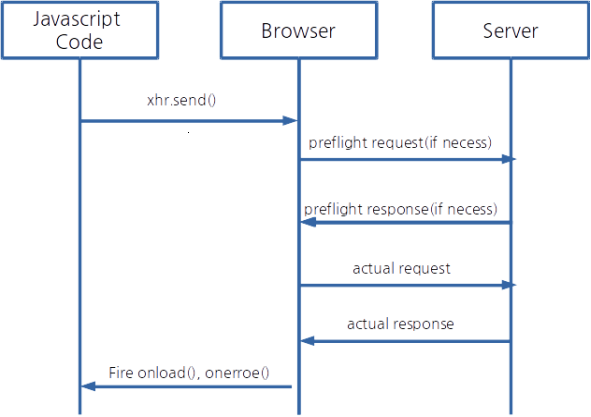

# ABOUT CORS (Cross-Origin Resource Sharing)

### 개요 
Same Origin Policy 제약을 피하는 방법.

Document내 HTTP 요청은 기본적으로 Cross-Site HTTP Requests가 가능하다.

다시 말하면,  태그로 다른 도메인의 이미지 파일을 가져오거나, <link> 태그로 다른 도메인의 CSS를 가져오거나, <script> 태그로 다른 도메인의 JavaScript 라이브러리를 가져오는 것이 모두 가능하다.(embedding)

하지만 <script></script>로 둘러싸여 있는 스크립트에서 생성된 Cross-Site HTTP Requests는 Same Origin(scheme, domain, port) Policy를 적용 받기 때문에 Cross-Site HTTP Requests가 불가능하다.

- CORS는 W3C스펙, BROWSER의 Cross Domain Communication 허용을 위한.
- XMLHttpRequest객체를 개발자가 same-domain request롤 활용할 수 있게 허용.(same-origin policy 회피)

간단한 예  
- bob.com 이 alice.com 에 접근하고 싶다.(bob.com 도큐먼트에서 alice.com로 xhr요청) (same-origin policy에 의해 허용되지 않는 상황)
- 그러나, CORS 요청을 지원하고, alice.com도 응답으로 특정 Header(Access-Control-Allow-Origin)을 보낸다면, bob.com이 접근가능
- Client는 cross-origin request를 만들어야하고 (브라우저가 함)
- Server 에서도 CORS-support 설정을 해야한다.


### CORS 요청 생성
```javascript
function createCORSRequest(method, url){
  var xhr = new XMLHttpRequest();
  if("withCredentials" in xhr){
    // XMLHttpRequest 객체에 withCredentials property가 있으면 XMLHttpReuqest2 객체이다.
    xhr.open(method, url, true);
  }else if(typeof XDomainRequest != "undefined"){
    //IE 환경 지원
    xhr = new XDomainRequest();
    xhr.open(method, url);
  }else{
    xhr = null;
  }
  return xhr;
}

var xhr = createCORSRequest('GET', url);
if(!xhr){
  throw new Error('Cors not Supported');
}

```

#### Event handler
- 전통적으로 XMLHttpRequest는 onreadystatechange 이벤트 핸들러 가짐  
XHLHttpReuqest2 는 더 가짐.  

| Event Handler   |      Desc      |
|----------|:-------------:|
| onloadstart| 요청이 start되었을때 |
| onload |    요청이 성공적으로 완료되었을때   |
| onloadend | 요청이 완료되었을때 (성공실패 무관) |
| onprogress | 데이터가 로딩되거나 보내질때 |
등등 있음  

활용 케이스

```javascript
xhr.onload = function(){
  var responseText = xhr.responseText;
  console.log(responseText;)
}
```

#### withCredentials
cookies 요청에 포함하려면  
`xhr.withCredentials = true;`  
`Access-Control-Allow-Credentials: true`(preflight response) 해야한다.

#### 요청보내기
모든 설정이 완료되면 ,`xhr.send();`로 요청 보내기  
```javascript
function makeCORSRequest(){
  var url = 'http://otherdomain.com';
  var xhr = createCORSRequest('GET',url);

  xhr.onload = function(){
    var text = xhr.responseText;
    console.log('XHR LOADED, Response is', text);
  }

  xhr.send();
}
```


### 서버에 CORS supporting 설정
- CORS는 browser와 server간 다뤄지는 문제이다.
- 브라우저는 헤더를 더 추가하고, 때로는 추가 요청(preflight)을 보낸다
- 물론 이런 브라우저의 조치는 Client는 겉보기로는 알수 없다.  


- 이런것들에 대한 구현은 Browser Manufacturer에서도 올바르게 구현해야한다


#### CORS type
- Cors 요청 타입은
  1. simple request
  2. not-so-simple request  

1. Simple Reuqest 는  
HTTP METHOD : HEAD GET POST  
HTTP HEADER : Accept, Accept-Language, Content-Language, Last-Event-ID, Content-Type(only application/x-www-form-urlencoded, multipart/form-data, text/plain)    
일 경우.  
예)JSON-P corss-domain GET 요청, HTML from POST 요청 경우
위 조건을 만족하지 않으면   not-so-simple

2. not-so-simple Request는  
- preflight, actual request로 구성된다


#### Handling a simple Request
GET JS 요청
```javascript
var url = 'http://otherdomain.com/cors';
var xhr =  createCORSRequest('GET',url);
xhr.send();
```
HTTP Request
- Origin Header가있다고 해서 모두 CORS 요청은 아니지만, 모든 CORS 요청은 Origin 가짐  

```
GET /cors HTTP/1.1
Origin: http://otherdomain.com/cors    //CORS요청에 항상있는 헤더(scheme+domain+port) 브라우저 영역, 유저가 컨트롤 불가
Host: api.alice.com                   //요청을 보낼 서버
Accept-Language: en-US
Connection: keep-alive
User-Agent: Mozilla/5.0...
```

- 참고)
Same-origin request
```
POST /cors HTTP/1.1
Origin: http://api.bob.com
Host: api.bob.com
```
<strong>same-origin request에서 브라우저는 CORS 응답을 기대하지는 않는다</strong>

```
Access-Control-Allow-Origin: http://otherdomain.com    //요청 Origin이 여기에 포함되지 않으면 서버는 물론 에러를 보냄
Access-Control-Allow-Credentials: true
Access-Control-Expose-Headers: FooBar
Content-Type: text/html; charset=utf-8
```  


모든 CORS 관계된 Header는 Acess-Control-* 형태이다
- Access-Control-Allow-Origin (required) : 모든 Valid한 CORS응답에 포함되야한다.   
모든 사이트가 접근하는 걸 허용하려면  *
- Access-Control-Allow-Credentials (optional) : 디폴트로 cookie는 CORS 요청에 포함되어있지 않지만, 포함시키고 그 포함시킨것을 가리키려면  
ture로 세팅 (XMLHttpRequest2 객체 withCredentials 값도 true로 ...)
- Access-Control-Expose-Headers (optional) : 클라이언트에 노출되도 되는 헤더 리스팅  
클라이언트는 XMLHttpRequest2.getResponseHeader()메서드로 위 헤더에서 리스팅된 CORS 응답 헤더에 접근 할 수 있다


#### Handling a not-so-simple Request
에) PUT or DELETE , content-type : application/json 인 경우  
하나의 요청으로 보이지만, 실제로 2개의 요청으로 구성된다
1. browser 가  preflight 요청을 보낸다 : 서버에 실제 요청(actual request)를 만들어도 되는지 물어보는 행위
2. actual request :  grant되면 실제 요청 보낸다  
Preflight 지원하려면 서버는 OPTIONS메서드 지원해야한다.  
Preflight Response는 캐시될수 있다. (매번 요청할때 마다 발행 필요 없게 하기위해)

Preflight Request
```
OPTIONS /cors HTTP/1.1
Origin: http://api.bob.com
Access-Control-Request-Method: PUT
Access-Control-Request-Headers: X-Custom-Header
Host: api.alice.com
Accept-Language: en-US
Connection: keep-alive
User-Agent: Mozilla/5.0...
```  
- Access-Control-Request-Method : Actual Request에서 사용할 메서드 기술
- Access-Control-Request-Headers : 실제 요청에 포함되는 헤더들 기술  
서버는 Preflight 요청 위 2개 헤더 정보를 가지고 , actual request를 허용 할 것인지 판단한다.  
허용을 하겠다면 Preflight Response를 보낸다
```
Access-Control-Allow-Origin: http://api.bob.com
Access-Control-Allow-Methods: GET, POST, PUT
Access-Control-Allow-Headers: X-Custom-Header
Content-Type: text/html; charset=utf-8
```
- Access-Control-Allow-Origin (required) : 접근 허용할 도메인 리스트
- Access-Control-Allow-Methods (required) : 접근 허용할 메서드 리스트 supported모든 메서드 리턴
- Access-Control-Allow-Headers(Access-Control-Request-Headers가 요청에 있었다면 required) : 서버에서 서포트되는 요청 헤더 리스트
- Access-Control-Max-Age (optional) - 브라우저가 해당시간동안  preflight response 캐시함(브라우저가 매 요청마다 2번 요청을 만들어 보내는것 방지)  


Preflight가 성공하면 Actual 단계로..  
preflight 단계에서 서버가 CORS요청을 DENY하고 싶으면, CORS 헤더없는 일반적인 응답을 보내면됨(브라우저는 그러면 actual request만들지 않음)


참고1 [link](www.html5rocks.com/en/tutorials/cors/)
참고2 [link](http://hanmomhanda.github.io/2015/07/21/Cross-Origin-Resource-Sharing/)
