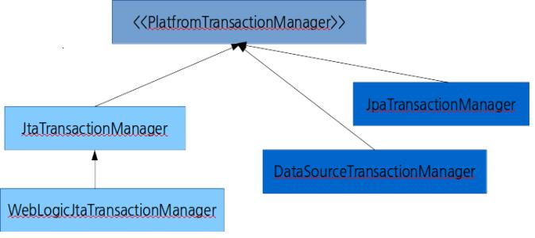

# Spring Transaction 관리

#### - 용어 정리
  1. 트랜젝션 리소스 : 트랜젝션 대상이 되는 리소스(ex. 데이터 베이스)
  2. Local Transaction : 단일 Transaction에서 관리해야하는 리소스가 1개
    (ex. 1트랜젝션에서 2개 테이블 수정해야하는경우 - 트랜젝션 리소스는 DB 뿐.)
  3. Global(Distributed) Transaction : 단일 Transaction에서 관리해야하는 리소스가 2개 이상
    (ex. 1트랜젝션에서 JMS메세지 메시징 미들웨어로 전송 + DB 업데이트)
    (ex. 1트랜젝션에서 MQ와 DB를 모두 관리해야할때)
    JTA 가 필요함.


#### - 방식
  1. 선언적방식(Declartive)
  2. Programatic 방식


#### - 스프링에서 제공하는 트랜젝션 관리자.(인터페이스 / 구현체)
  


## Programatic 트랜젝션 관리
(2가지방법))
1. PlatformTransactionManager 직접구현. (DataSourceTransactionManager)
2. TransactionTemplate 사용 -> 더 선호


why? : DataSourceTransactionManager를 사용하면 명시적으로 트랜젝션 시작, 커밋, 롤백 해야함. Application Code가 POJO스럽지 않고 Spring noise가 많이 들어간다.
따라서 DataSourceTransactionManager 를 랩핑해서 한 단계 추상화된 TransactionTemplate를 선호함.


##### - 빈 구성  

```
<bean id="dataSource" class="...XXXDataSource"/>

<bean id="txManager" class="...DataSourceTransactionManager">
  <property name="dataSource" ref="dataSource"/>
</bean>

<bean id=transactionTemplate"
  class="...TransactionTemplate">
  <property name="transactionManager" ref="txManger"/>
  <property name="isolationLevelName" value="ISOLATION_READ_COMMITED"/>  //격리와 전파는TransactionDefinition에서 정의된 값.
  <property name="propagationBehaviorName" value="PROPAGATION_REQUIRED"/>
```

##### - 코드 예제  
```java
@Autowired
private TransactionTemplate transactionTemplate;

@override // 계죄에서 예금 인출 + 정기예금에 불입 : 1 트랜텍션
public int createFixedDeposit(final FixedDepositDetails fixedDepositDetails){
  FixedDepositDetails details = transactionTemplate.execute(new TransactionCallback<FixedDepositDetails>(){
    //트랜젝션 템픗릿이 호출하는 메서드
    public FixedDepositDetails doInTransaction(TransactionStatus status){
      try{
        myFixedDepositDao.createFixedDeposit(fixedDepositDetails);
        bankAccountDao.subtract(
                                fixedDepositDetails.getBankAccId(),
                                fixedDepositDetails.getFixedDepositAmount());
      }catch(RuntimeException){
        //롤백
        status.setRollbackOnly();
      }
      return fixedDepositDetails;
    }
  });
  return details.getFixedDepositId();
}

//리턴밧 필요없으면 TransactionCallbackWithoutResult 사용
```


## Declarative 트랜젝션 관리
transactional proxies를 기반으로 동작 (2가지방법)  

1. \< aop: \>  , \< tx: \>를 기반으로 하는 설정
2. ```@Transactional``` 를 이용.
 - 장점 : 이방식을 사용하면 비즈니스로직와 트랜젝션 관리 로직이 분리 된다.
 - ```@Transactional```은 인터페이스, 클래스, 메서드에 사용가능하고, 클래스 or 인터페이스에 사용하면 전체적용됨.
      거기에 추가적으로 메서드에 사용되면 재정의됨.
 - ```java.lang.RuntimeException```이 발생하면 롤백이된다.


 ```@Transactional``` 이용하기 위한 설정
```
<tx:annotation-driven transaction-manager="txManager"/><!-- a PlatformTransactionManager is still required -->
    <bean id="txManager" class="org.springframework.jdbc.datasource.DataSourceTransactionManager">
        <!-- (this dependency is defined somewhere else) -->
        <property name="dataSource" ref="dataSource"/>
    </bean>
```
혹은 어노테이션 기반으로
```java
@Configuration 클래스에 @EnableTransactionManagement  추가하면됨
```

##### - @Transactional 의 프로퍼티
  1. proxy-target-class
    디폼트 는 false : inferface-based proxy 생성  
             true : class-based proxy 생성  
             스프링 프록시관련 링크[link](http://docs.spring.io/spring-framework/docs/4.2.x/spring-framework-reference/html/aop.html#aop-proxying)
  2. mode : default value is 'proxy'(프록시로 트랙젝션 관리) , 'aspectj' 이면 weaving-based aop 로 트랜젝션 관리


##### - 리스너 사용(트랜젝션 트래킹)
```@TransactionalEventListene ``` 를 사용하면
BEFORE_COMMIT, AFTER_COMMIT (default), AFTER_ROLLBACK and AFTER_COMPLETION
에 대해서 트래킹  

```java
@Component
public class MyComponent {

    @TransactionalEventListener
    public void handleOrderCreatedEvent(CreationEvent<Order> creationEvent) {
          ...
    }
}
```

##### 주의 사항
1. proxy 모드 에서는 ```@Transactional``` 이 되있더라도 Extrenal call 아니면 인터셉트 되지 않는다. 즉 타겟 객체에서 self-invokation된 메서드는 트랜젝션 처리 않됨.
2. proxy가 생성될때 트랜젝션 관련한 것이 완전히 초기화가 이루어짐. ```@PostConstruct``` 를 의존한 초기화 코드 작성하면 안된다.
3. Method Visility : 오직 ```public``` 메서드 에만 ```@Transactional``` 이 적용됨. non-public에 적용하려면 ```mode=aspectj```를 이용해야함 load time weaving일어남 (Target Object 의 바이트코드 변경일어남)
